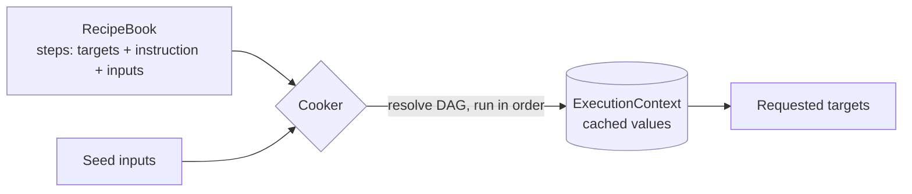
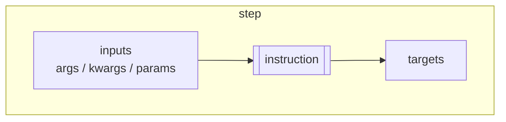
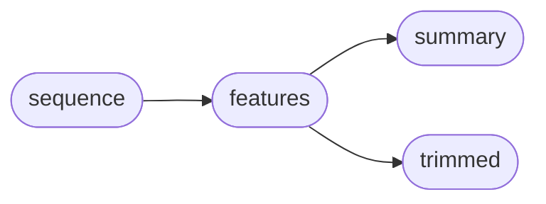
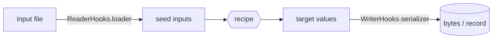
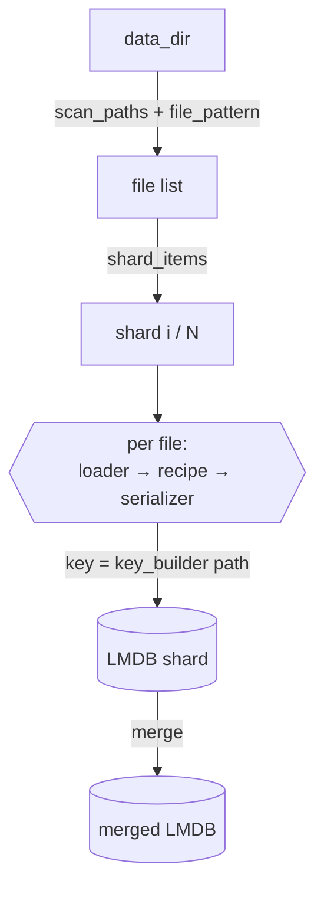

# DataCooker (Concepts)

DataCooker is a small, **domain-agnostic static-workflow engine**. You declare
*what* you want to build (**targets**) and *how* to compute it
(**instructions**) with **inputs** that reference other targets. The engine
turns those declarations into a dependency graph, resolves the order, runs each
step once, caches results, and returns the outputs you asked for.

DataCooker knows nothing about any particular data type — instructions are
plain callables, and values are whatever you put in the cache. The same recipe
can be run on an in-memory dict, on a single file, or fanned out over a whole
directory into an LMDB; only the surrounding I/O changes, not the recipe.

!!! info "DataCooker vs. StructCooker — where the boundary is"
    **DataCooker** (this site) is the **generic engine**: RecipeBook, the
    Cooker, hooks, and the LMDB workflows. It ships only domain-agnostic
    helpers (e.g. `merge_dict`, `key_stack`, `single_value_instruction`).

    **StructCooker** is a **separate package built on top of DataCooker** that
    supplies the *biomolecular domain*: structure/MSA/template readers,
    `CIFMol`/`TemplateMol` objects, and the recipes that ingest those datasets.

    Rule of thumb: anything tied to molecules, sequences, or structures lives in
    StructCooker; anything about *running recipes* lives here. Examples in these
    docs stay domain-neutral on purpose — see StructCooker's own docs for
    biomolecular recipes.

## The big picture

1. You build a **RecipeBook** of steps.
2. You seed the **inputs**.
3. The **Cooker** resolves the dependency graph, runs each step once, and stores
   every value in the **ExecutionContext**.
4. You **serve** the targets you requested (others are computed only if needed).

## Core concepts

### RecipeBook & steps

A **RecipeBook** is an ordered set of **steps**. Each step declares:

- **targets** — its named outputs, each with a type, e.g. `("features", dict)`.
- **instruction** — a callable that produces those outputs.
- **inputs** — how the instruction's parameters bind to other targets:
  `args` (positional), `kwargs` (by name), and `params` (literal constants).

Add steps with `add(targets, instruction, inputs)` (canonical) or the
keyword-style `step(outputs, instruction, *, args, kwargs, params)`.

### Targets form a DAG

Because each step's inputs name other targets, a RecipeBook is really a
**directed acyclic graph** over named values. The engine computes a topological
order and runs only what a requested target depends on.

Asking for `summary` runs `sequence → features → summary`; `trimmed` is skipped.
Cycles, duplicate targets, and missing inputs are reported as errors before
anything runs (`validate()`).

### Cooker & ExecutionContext

The **Cooker** is the executor: it resolves dependencies, expands wildcard
inputs, detects cycles, and runs instructions. The **ExecutionContext** is the
keyed store holding seeded inputs plus every intermediate and final value, so no
target is computed twice.

### Reader / Writer hooks

For file- and database-oriented runs, DataCooker wraps a recipe with pluggable
I/O:

- **ReaderHooks** — a `loader` turns a file into seed inputs; an optional
  `key_transform` shapes cache keys.
- **WriterHooks** — a `serializer` encodes the result to bytes; a `materializer`
  controls how it is written.

## Running a recipe

The public entry points live on the top-level `datacooker` package:

| Function | Use it when |
| --- | --- |
| `execute(book, inputs, targets=...)` | you already have an in-memory input dict |
| `parse_dict(book, datadict, targets=...)` | same, with the parsing/IO conventions |
| `parse_file(recipe, file_path, loader=..., targets=...)` | a file should be loaded into inputs first |
| `run_recipe(recipe, inputs=..., reader=..., writer=...)` | you want reader/writer hooks applied |

## Scaling out: LMDB workflows

For large datasets the config-driven LMDB pipeline (`python -m
datacooker.cli.lmdb`) discovers files, runs the recipe per file, and writes one
record per entry — optionally sharded across many workers.

See [Build an LMDB](tutorials/build_lmdb.md) for the config and CLI.

## Next steps

- [Getting Started](getting-started.md) — install and run a first recipe.
- [Write a recipe](tutorials/make_recipe_basic.md) — targets, instructions, inputs.
- [Build an LMDB](tutorials/build_lmdb.md) — fan a recipe over a dataset.
- [API](api.md) — the public `datacooker` surface.
