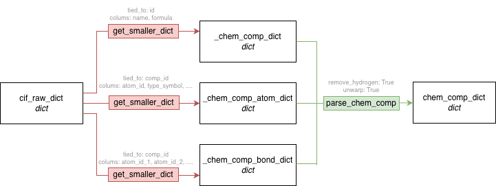

## Make your own recipe: Level 0

Let's practice how to make recipe for your own data object/file.
The practice for this tutorial is the easiest parsing pipeline - parse CCD for making organized CCD data dictionary.

## 1. Conceptualizing the Data Flow

Before coding, visualize the entire process in your mind - from raw inputs to the final deliverable, including every step in between.



* **Input**: `cif_raw_dict` (e.g., raw MMCIF data loaded from a file).
* **Intermediates**: Data separated into specific categories like components, atoms, and bonds (e.g., `_chem_comp_dict`).
* **Final Target**: A unified dictionary of `FeatureContainer` objects ready for BioMol integration.

## 2. Core Components of a Recipe (`RecipeBook.add`)

A Recipe step consists of three pillars: **Targets**, **Instructions**, and **Inputs**. Understanding the role of `params` vs `kwargs` is essential for controlling the parsing process.

### 🎯 Target (Output Definition)
* Defines the **unique name** and **data type** for the result.
* The target name (e.g., `_chem_comp_dict`) is used as a reference for subsequent steps.

### 🛠️ Instruction (Transformation Tool)
* The function that executes the logic.
* Instructions are mandatory considerations for your design.
* It can be a direct function or a pre-configured one like `get_smaller_dict(dtype=str)`.

### 📥 Input (Ingredients and Controls)
* **kwargs (Data to Process)**: These are the actual values retrieved from the `ParsingCache`. They represent the primary data to be transformed.
* **params (Control Information)**: Arguments used to adjust the parsing behavior, such as selecting specific columns or removing hydrogens.

### 🧪 Practical Example: CCD Parsing
You can group independent operations (like extracting atom and bond data) into lists to register them simultaneously.

```python
# Step 1: Extracting smaller dictionaries from raw CIF data
ccd_recipe.add(
    targets=[
        (("_chem_comp_dict", dict),),
        (("_chem_comp_atom_dict", dict),),
        (("_chem_comp_bond_dict", dict),),
    ],
    instruction=get_smaller_dict(dtype=str),
    inputs=[
        {
            "kwargs": {"cif_raw_dict": ("_chem_comp", str | None)},
            "params": {"tied_to": "id", "columns": ["name", "formula"]},
        },
        {
            "kwargs": {"cif_raw_dict": ("_chem_comp_atom", str | None)},
            "params": {
                "tied_to": "comp_id",
                "columns": ["atom_id", "type_symbol", "charge", "model_Cartn_x", "model_Cartn_y", "model_Cartn_z"],
            },
        },
        {
            "kwargs": {"cif_raw_dict": ("_chem_comp_bond", str | None)},
            "params": {
                "tied_to": "comp_id",
                "columns": ["atom_id_1", "atom_id_2", "value_order"],
            },
        },
    ],
)

# Step 2: Merging them into a final feature-rich dictionary
ccd_recipe.add(
    targets=(("chem_comp_dict", dict),),
    instruction=parse_chem_comp(),
    inputs={
        "kwargs": {
            "chem_comp_dict": ("_chem_comp_dict", dict | None),
            "chem_comp_atom_dict": ("_chem_comp_atom_dict", dict | None),
            "chem_comp_bond_dict": ("_chem_comp_bond_dict", dict | None),
        },
        "params": {"remove_hydrogen": True, "unwrap": True},
    },
)
```

## 3. Implementing Custom Instructions
An Instruction is any Callable that accepts kwargs and params as arguments. Below are examples based on instructions used in the CCD parsing workflow.

### Option 1: Simple Function
Ideal for direct processing where pre-configuration isn't needed.

```python
def parse_chem_comp(kwargs: dict, **params):
    """
    Example: The final integration step in CCD parsing.
    Receives 'kwargs' (dicts from cache) and 'params' (boolean flags).
    """
    # Extract data from kwargs
    comp_dict = kwargs.get("chem_comp_dict")
    atom_dict = kwargs.get("chem_comp_atom_dict")
    bond_dict = kwargs.get("chem_comp_bond_dict")
    
    # Extract controls from params
    remove_h = params.get("remove_hydrogen", True)
    unwrap = params.get("unwrap", False)

    # Logic to create NodeFeatures and EdgeFeatures
    ...
    return output
```


### Option 2: Wrapper Function (Closure)
```python
def get_smaller_dict(*, dtype: type):
    """
    Example: A wrapper returning a worker specialized for 'dtype'.
    The worker captures 'dtype' from the outer scope to cast values correctly.
    """
    def _worker(kwargs: dict, **params):
        # Retrieve raw data and keys from kwargs/params
        cif_raw_dict = kwargs.get("cif_raw_dict")
        tied_to = params.get("tied_to")
        
        # The logic here is functionally dependent on the 'dtype' passed to the wrapper
        # For every item in the dictionary, cast it to the captured dtype
        result = {}
        for key, value in cif_raw_dict.items():
            result[key] = [dtype(v) for v in value] # dtype affects the outcome here
            
        ...
        return result

    return _worker # Returns a worker specialized with the captured state
```

While simple recipes like parse_CCD may not strictly necessitate higher-order functions that return specialized callables based on input arguments, this pattern is documented here for scalability in complex workflows. This approach leverages closures to achieve partial application, 'baking' specific configuration state into the returned function to determine its behavior at runtime."

